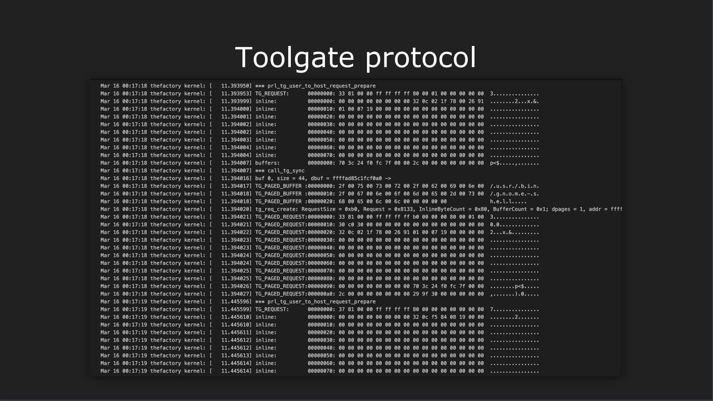

# Parallels Desktop VM Escape Exploit
Full proof-of-concept exploit for Parallels Desktop hypervisor (Pwn2Own 2021 Vancouver).

Technical walkthrough video: [Advanced Exploitation of Simple Bugs](https://youtu.be/6UhgLteN-PU) ([Slides](https://zerodayengineering.com/research/slides/ZDE2021_AdvancedEasyPwn2Own2021.pdf))

Further learning: [Hypervisor Vulnerability Research: State of the Art](https://youtu.be/1bjekpgZCgU) ([Slides](https://zerodayengineering.com/research/slides/POC2020_HypervisorVulnerabilityResearch.pdf)) 

Nothing changes in decades in system internals on the level on which my talks and courses are built.

[Story blog](https://zerodayengineering.com/research/pwn2own-2021-vm-escape.html)

## Notes

A virtual machine escape exploit typically requires kernel privileges in the guest OS. In this exploit I chose to offload the reverse-engineered toolgate protocol implementation (`prl_pwn.py`) to a Python module, while keeping low-level kernel code (`km`) minimal, just enough to implement the attack interface - a nod to the principle of minimal privilege in systematical software engineering, which we miss a lot in non-trivial exploit development.

_
Spot the bug
_

Protocol prototyping code is deliberately structured as well, with low-level API wrapped into a very simple high level exploit code.

Here is where we are in the big picture of things:  

_
Hypervisor Attack Surface model
_

Python code interfaces with kernel via a Linux device exported by `km` kernel module. One of the things that I had to figure out is how to pass pointers over the interface, which Python can't do natively.

`doit.sh` is simply a bash wrapper which ensures that the box is in the correct state, and puts together the attack.

## Contacts 
Author: Alisa Esage ([@alisaesage](https://twitter.com/alisaesage))  
My project: [Zero Day Engineering Training & Intelligence](https://zerodayengineering.com)  
Email: [contact@zerodayengineering.com](mailto:contact@zerodayengineering.com)